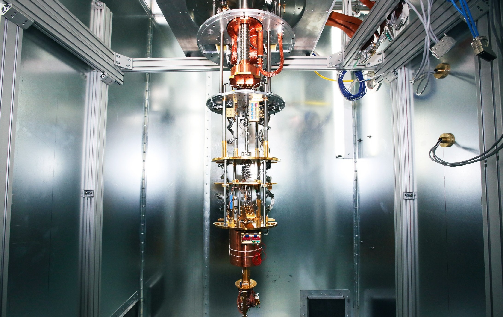
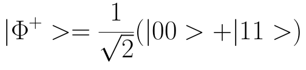
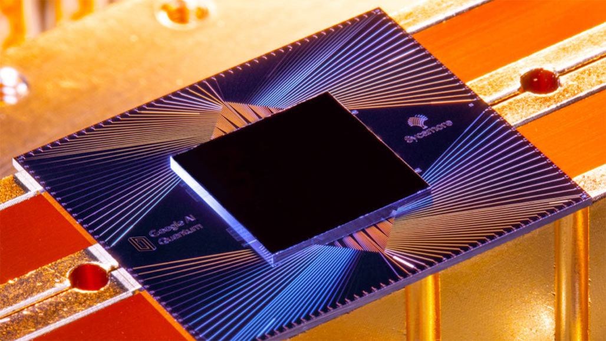

# "কোয়ান্টাম সুপ্রেমেসি"

-Admin | 21-02-20220

*photo credit: [wired](https://www.wired.com/story/googles-quantum-supremacy-isnt-end-encryption) *

কদিন আগেরই কথা, বাপরে! কত হইচই, কত লেখালিখি, কত আলোচনা। গুগল নাকি কোয়ান্টাম সুপ্রেমেসি প্রমাণ করে ফেলেছে। কিন্তু এই কোয়ান্টাম সুপ্রেমেসি ব্যাপারখানা ঠিক কি? কিন্তু তার আগে এই কোয়ান্টাম ব্যাপারটাই বা কি?

কোয়ান্টাম মেকানিক্স নিয়ে পরে কখন লেখা যাবে। এখানে শুধু কোয়ান্টাম কথার অর্থ টুকু বুঝলেই চলবে।

কোয়ান্টাম (বহুবচন কোয়ান্টা ) আক্ষরিক অর্থে  'পরিমাণ' কিন্তু বর্ত্মানে এই শব্দ ব্যাবহার করা হয় অন্য অর্থে। কোন পদার্থের যথাসম্ভব ক্ষুদ্র উপাদানের যেকোন ভৌত ধর্মের বিযুক্ত(discrete) একক কে বোঝাতে কোয়ান্টাম শব্দের ব্যবহার হয়ে থাকে।

দৈনন্দিন জীবনে আমরা যেসব ডিজিটাল যন্ত্রের সাহায্য নিয়ে থাকি তাদের সবাইকেই কম্পিউটার বলা চলে। এই  সমস্ত যন্ত্রই বহু  জটিল গাণিতিক সমস্যার  সমাধানের সাহায্যে আমাদের রোজকার জীবনে নানারকম ভাবে সাহায্য করে থাকে। এই সমস্ত গাণিতিক সমস্যার সমাধান বহু উপায়েই করা সম্ভব। আর এই আলাদা আলাদা পদ্ধতির জটিলতাও(complexity)  বদলাতে থাকে।  ঠিক যেমন অঙ্ক বইয়ের সমস্যা গুলি সমাধানের একধিক উপায় থাকে, তার কোণটা সহজ আবার কোণটা শক্ত। আবার কোন সমস্যা কোন পদ্ধতিতে  করা হবে তার উপরই নির্ভর করে ব্যায়িত সময়।

এখন দেখা যাক এই  পরিচিত কম্পিউটার ঠিক কেমন করে কাজ করে। আমরা কম বেশি সবাই জানি যে কম্পিউটার বাইনারি ভাষা বোঝে অর্থাৎ ০ এবং ১ এর বাইরে কিছুই সে বোঝে না। ০ বা ১ এদের একটা বিট বলা হয় যা কম্পিউটার এর গঠনমূলক একক। এই বিট গুলো কম্পিউটার তার রেজিস্টার এ লিখে রাখে যা ইন্ট্রিগ্রেটেড চিপের মধ্যে সাজিয়ে, তা দিয়ে তৈরি হয় কম্পিউটার এর বিভিন্ন যন্ত্রাংশ । এখন মুশকিল হল আমাদের পরিচিত কম্পিউটার(পড়ুন রেজিস্টার)  একটি নির্দিষ্ট সময়ে একটা নির্দিষ্ট স্টেট  এই থাকতে পারে অর্থাৎ এক বিটের সিস্টেম হলে ০ অথবা ১, দুই বিট হলে ০০, ০১, ১০, ১১ এদের মধ্যে যে কোন একটায় বা n বিট সিস্টেম হলে 2^n টি আলাদা আলাদা স্টেট এর মধ্যে যেকোনো একটি তেই, পর মুহুর্তে অবশ্য স্টেট বদলে যেতে পারে।  এই রকম আর্কিটেকচার (গঠন) এর জন্যে, এমন অনেক গাণিতিক সমস্যা আছে যা গণনাকার্যকে ধীর করে দেয়। এইজন্যই কোয়ান্টাম কম্পিউটার এর কথা ভাবা সুরু হয়।  এই কম্পিউটার তৈরিতে কোয়ান্টাম মেকানিক্সের বিভিন্ন ধারনা প্রয়োগ করার কথা ভাবা হয়। তার মধ্যে অন্যতম হল সুপারপসিশন।
সুপারপসিশন এমন একটি ধারনা যেখানে অনেক গুলি (যত ইচ্ছা) স্টেট (আপাদত ধরুন, বিভিন্ন বিট কম্বিনেশন )  একসাথে থাকতে পারে। অর্থাৎ ওয়ান বিট সিস্টেমে একটা নির্দিষ্ট বিট না হয়ে দুটি বিট একসাথে থাকতে পারে। এদের কিউবিট বলে(কোয়ান্টাম কম্পিউটারের গঠনমূলক একক)

উদাঃ

(এর ব্যাখ্যা পরের কোন পোষ্ট এ দেব )

প্রায় শেষ ৫-৬ দশক এই ধরনের কম্পিউটার তৈরির প্রচেষ্টা চালাচ্ছেন বিভিন্ন দেশের বিজ্ঞানীরা। আর স্বাভাবিক ভাবেই বিশ্বের বড় বড় আইটি কোম্পানিরাও হাত ধুয়ে লেগে পরেছে এই প্রতিযোগিতায়।
২০১২ সালে অধ্যাপক জন প্রেস্কিল সর্বপ্রথম কোয়ান্টাম সুপ্রেমেসি শব্দের প্রচলন করেন । তার মতানুযায়ি "quantum computers can do things that classical computers can’t, regardless of whether those tasks are useful” [1][1] অর্থাৎ কমপক্ষে এমন একটা কাজ যা সাধারণ কম্পিউটার করতে অক্ষম কিন্তু কোয়ান্টাম কম্পিউটার সক্ষম , তা আমাদের প্রয়োজনীয় হোক বা ন হোক।

২০১৯ এর ২৩ শে অক্টোবার গুগল বিশ্বকে জানায় তারা কোয়ান্টাম সুপ্রেমযাসি এচিভ করতে পেরেছে। তারা ৫৩ কিউবিট মেশিনের সাহায্যে র‍্যান্ডম বিট স্ট্রিং বানাতে সক্ষম হয়েছে বলে জানায়। তারা দাবি করেছে এই কাজ সাধারণ কম্পিটারের সাহায্যে করতে লাগতে পারে ১০০০ বছর।  যা বিজ্ঞান জগতে আলোড়ন সৃষ্টি 
করেছে।

এত বড় ঘটনা যখন ঘটেছে বিতর্ক তো থাকবেই। 

*photo credit: sciencenews.org*

আইবিএম দাবি করেছে সঠিক পরিকাঠামো এর সাহায্যে এই কাজ ২.৫ দিনে ক্লাসিকাল কম্পিউটারে করা সম্ভব।

এরম বিতর্ক তো চলতেই থাকবে যা আগামী দিনের বিজ্ঞান ও প্রযুক্তিকে আরও দৃঢ় করে করবে, তাই বিতর্ক চলুক, আলোচনা হোক!

[1] [quantamagazine](https://www.quantamagazine.org/john-preskill-explains-quantum-supremacy-20191002/)

[2] [sciencenews](https://www.sciencenews.org/article/google-quantum-supremacy-claim-controversy-top-science-stories-2019-yir)

 
 
 [back](../index.html)

[1]: https://www.quantamagazine.org/john-preskill-explains-quantum-supremacy-20191002/
