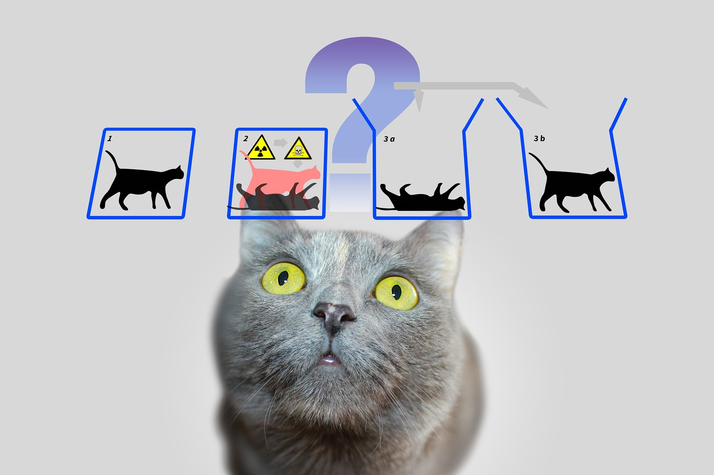
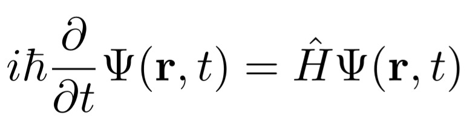

# Schrödinger Cat Experiment নিয়ে বিস্তারিত

Admin | 03-03-2020

স্ক্রডিঞ্জার ক্যাট এক্সপেরিমেন্ট, অতি বহুল প্রচারিত এক্সপেরিমেন্ট। বেশীর ভাগ মানুষ শুধু জানেন, বিড়াল টা হয় মৃত অথবা জীবিত। আজ এই থট এক্সপেরিমেন্ট ও কোয়ান্টাম মেকানিক্সের কিছু ধারনা নিয়ে কথা বলব।

এই স্ক্রডিঞ্জার সাহেব ই প্রথম কোয়ান্টাম মেকানিক্সের ফর্মাল গাণিতিক সমীকরণ দেন(১৯২৫) । তারপর বহুদিন শুধু সমীকরণের সমাধানের ব্যাখ্যা নিয়েই আলচনা হতে থাকে। আসলে স্ক্রডিঞ্জার এর সমীকরণ নিউটনের F=ma(ধ্রুবক ভরের জন্য) এর মতোই মৌলিক। এই সমীকরণ এর নিজস্ব কিছু স্বীকার্য আছে। তাই নিয়ে নানান বিদ্বজ্জনের নানান মত ছিল। সে তো থাকবেই। এই সমীকরন ছিল বস্তুকনার অদ্ভুত আচরনের ব্যাখ্যা কিন্তু সমীকরণের সমাধান হল  ওয়েভ (তরঙ্গ) বা আরও নিখুঁত ভাবে বললে ওয়েভ প্যাকেট। কণাকে যে তরঙ্গ আকারে ব্যাখ্যা করা যায় সে ব্যাপারে অনেক আগেই ডি-ব্রগ্লি তার পি.এইচডি থিসিস এ বলেন। কিন্তু তরঙ্গটা কিসের এই নিয়ে বিস্তর দন্দ্ব। এই ধরুন জলে ঢিল ছুড়লে জলের তরঙ্গ, আবার  শব্দ হল বায়ুকণার কম্পন। তো এই  বস্তুর তরঙ্গ টা আবার কি ? স্ক্রডিঞ্জার বললেন বস্তু কণা আসলে একটি তরঙ্গ আকারে নির্দিষ্ট স্থানে ছরিয়ে থাকে। এই নিয়ে নানান বিজ্ঞানীর মধ্যে মত পার্থক্য হয়। একটা কণা কীভাবেই বা তরঙ্গ আকারে থাকতে পারে। ১৯২৭ সালে  ম্যাক্স বর্ণ ধারণা দেন এই তরঙ্গ আসলে সম্ভাব্যতার(probability)। এই নিয়ে তো হইচই শুরু হয়ে যায়। এই প্রসঙ্গে বলে রাখি, সেই যুগে বিজ্ঞানের অন্যতম নক্ষত্র স্বয়ং আইনস্টাইন ও এই সম্ভাব্যতা ধারনার ঘোর বিরোধি ছিলেন। তিনি বলেছিলেন "God doesn't play dice"
তো সম্ভাব্যতার তরঙ্গ আসলে কি? ম্যাক্স বর্নের মতানুসারে, তরঙ্গের বিস্তার(amplitude) বা কঠোরভাবে বলতে, স্ক্রডিঞ্জার সমীকরণের তরঙ্গ সমাধানের বর্গ  কোন স্থানে বস্তুকনাকে পাওয়ার সম্ভাব্যতার সমানুপাতিক। 

স্ক্রডিঞ্জার তা মানবেন কেন ? উনি একটি থট এক্সপেরিমেন্ট করেন যা "স্ক্রডিঞ্জার ক্যাট এক্সপেরিমেন্ট" নামে পরিচিত।
উনি ভাবলেন, একটি বিড়াল ও একটি তেজস্ক্রিয় পদার্থ একটি বাক্সের মধ্যে একসাথে আছে। তিনি আরও বললেন সেখানে একটি কাঁচের বিকারে বিষাক্ত রসায়নিক পদার্থ আছে যেটি কিনা বিকিরণ গ্রহণ করা মাত্রই ভেঙ্গে যাবে ও তাতে বিড়াল টি মারা যাবে। এখন ওই তেজস্ক্রিয় পদার্থের বিকিরণ দেবার সম্ভাব্যতা যদি ঘনটায় ৫০ শতাংশ হয় তবে ১ ঘন্টা পর বিড়াল টি একই সাথে মৃত আবার জীবিত।

একটু খোলসা করে বললে বর্নের কথা মত যদি ওই তেজস্ক্রিয় পদার্থের বিকিরণ সম্ভাব্যতার উপর নির্ভর করে ও তা যদি এক ঘন্টায় ৫০ শতাংশ হয় তবে এক ঘন্টা পর পদার্থ টি বিকিরণ  করা বা না করার সভাব্যতা সমান এবং তা আগে থেকে বলা সম্ভ্যব নয়। ঠিক যেমন ঝোঁক শূন্য কয়েন  নিয়ে টস করলে তার হেড বা টেল পরার সম্ভাব্যতা সমান এবং আগে থেকে বলা সম্ভব নয়।  এই এক্সপেরিমেন্ট এর সাহায্যে স্ক্রডিঞ্জার বোঝাতে চাইলেন বিড়াল টি একই সাথে জীবিত বা মৃত এমন ঘটনা বাস্তবে সম্ভব নয় এবং বর্নের ব্যাখ্যা সম্পুর্ন ভুল।
অবশ্যই স্ক্রডিঞ্জার ভুল ছিলেন এবং তার এক্সপেরিমেন্ট এর যথাযথ ব্যাখা ম্যাক্স বর্ণ দেন। উনি বললেন স্ক্রডিঞ্জার আংশিক ভাবে ঠিক । বর্ণ ব্যখ্যা দিলেন, বাক্স টি যতক্ষন পর্যন্ত না খুলে দেখা হচ্ছে বিড়াল টি জীবিত না মৃত ততক্ষন বিড়াল টি জীবিত এবং মৃত উভয় অবস্থার (স্টেট) এর সমান সংমিশ্রন(সুপারপসিশন)। বাক্স টি খুলে দেখা মাত্র সেটি একটি নির্দিষ্ট সম্ভাব্য অবস্থানে পতন হবে। যা কিনা কোয়ান্টাম মেকানিক্সে "মেসারমেন্ট পস্টুলেট" নামে পরিচিত এবং এরম ঘটনার গাণিতিক ব্যাখ্যা ও বাস্তবিক প্রমাণ থাকলেও এমন টা কেন ঘটে তার কোন সদুত্তর এখনো পাওয়া যায়নি। সেই ব্যাখ্যা খুঁজতে বর্তমানে বহু বিজ্ঞানী নিরলস গবেষণা চালিয়ে যাচ্ছেন।



[back](../index.html)
