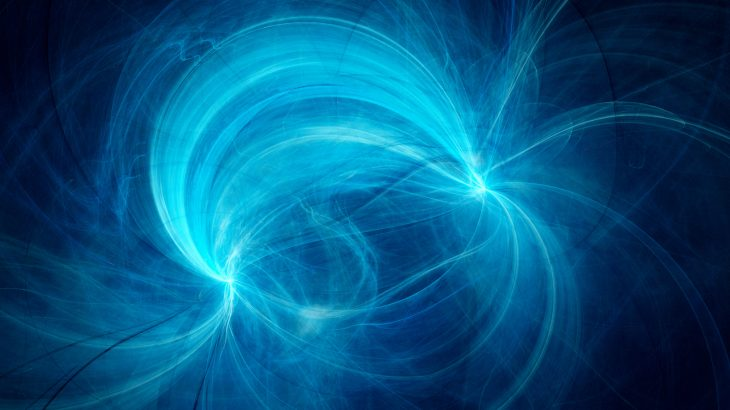

# চৌম্বকক্ষেত্র ও তড়িৎক্ষেত্রের আপেক্ষিকতা  (১) 

Admin | date

*credit: [earth.com](https://www.earth.com/news/weak-magnetic-fields-health/)*

তড়িৎক্ষেত্র ও চৌম্বকক্ষেত্রের সাথে আমরা সবাই কম বেশী পরিচিত। দেশের(স্পেস) কোণ স্থানে বৈদ্যুতিক আধান রাখলে তার চারপাশে এক তড়িৎক্ষেত্র আবিষ্ট হয়, যার সাহায্যে কোণ তড়িৎ আধান অন্য কোণ তড়িৎ আধানের উপর বল প্রয়োগ করে। চৌম্বকক্ষেত্র এর ব্যখ্যা এতটাও সহজ নয়। চৌম্বকক্ষেত্র বর্ণনা করতে তড়িৎপ্রবাহের কথা কল্পনা করতে হয়।  এই তড়িৎপ্রবাহের আশেপাশে একটি চৌম্বক ক্ষেত্র আবিষ্ট হয়। কোণ তড়িতাহিত কণা যদি কোণ চৌম্বকক্ষেত্রের সাপেক্ষে চলমান হয় তবে এই চৌম্বকক্ষেত্র একটি নির্দিষ্ট নিয়ম মেনে উক্ত কণার উপর বল প্রয়োগ করে। এ প্রসঙ্গে বলে রাখি, উক্ত কণা যদি চৌম্বক্ষত্রের সাথে সমান্তরাল ভাবে চলে তবে চৌম্বকক্ষেত্র তার উপর কোনরূপ বল প্রয়োগ করে না। 
 
 এখন কল্পনা করা যাক কোণ অসীম ভাবে বিস্তৃত তড়িৎপ্রবাহ তার চারিপাশে একটি স্থির(সময়ের সাপক্ষে) চৌম্বকক্ষেত্র আবিষ্ট করেছে। সেই চৌম্বকক্ষেত্রের সাপেক্ষে একটি তড়িৎ আহিত কণা একটি নির্দিষ্ট গতি নিয়ে লম্বভাবে গতিশীল। অর্থাৎ সেই কণার উপর চৌম্বকক্ষেত্র টি একটি বল প্রয়োগ করবে। এবার ধরাযাক পাঠক, তড়িতাহিত কণার অভিমুখে সমান গতিবেগ নিয়ে চলছে।  মনে রাখতে হবে তড়িৎপ্রবাহ উভয় দিকে অসীম পর্যন্ত বিস্তৃত  তাই চৌম্বকক্ষেত্র কোনভাবেই গতিশীল নয়(কণা বা পাঠকের সাপেক্ষে) । অর্থাৎ পাঠকের সাপেক্ষে কণাটি এখন স্থির। তারমানে কি চৌম্বকক্ষেত্রটি কণার উপর আর বল প্রয়োগ করবে না?
 
 পরিস্থিতি এখন কিছুটা এরম - তোমার বন্ধু তোমার সাপেক্ষে স্থির তাই সে কণাটির উপর একটি বল প্রয়োগ হচ্ছে বলে মনে করছে (কণাটির ত্বরণ থাকলেই সে বুঝবে কণাটির উপর নিশ্চয়ই বল প্রয়োগ হচ্ছে, নিউটনের দ্বিতীয় সূত্র) অন্যদিকে তুমি মনে করছ কণাটির উপর কোণ বল প্রয়োগ হচ্ছে না। অর্থাৎ প্রকৃতির নিয়ম একএক জনের কাছে একএক রকম। সেও কি সম্ভব? 
 
 ১৯০৫ খ্রিস্টাব্দে অ্যালবার্ট আইনস্টাইন একটি গবেষণা পত্র প্রকাশ করেন - *On the Electrodynamics of Moving Bodies[1][1]* । যা পরে বিশেষ আপেক্ষিকতাবাদ নামে জনপ্রিয় হয়। এই বিশেষ আপেক্ষিকতাবাদ এর দুটো স্বীকার্য আছে। 
 
১) সমবেগে চলমান সকল পর্যবেক্ষকের সাপেক্ষে প্রকৃতির নিয়মাবলী অভিন্ন ।(যা প্রথম প্রশ্নের সাথে অসমাঞ্জস্য) 
২) শূন্য মাধ্যমে আলোর গতিবেগ সমস্ত পর্যবেক্ষকের সাপেক্ষে একই এবং তা আলোর উৎসের ও পর্যবেক্ষকের গতির সাথে নিরপেক্ষ ।

এই দুই স্বীকার্যের সাহায্যে ভিন্ন পর্যবেক্ষকের স্থান ও সময়ের মধ্যে সম্পর্ক স্থাপন করেন । এগুলো সবটাই সনাতন পদার্থবিদ্যার থেকে অনেকটাই আলাদা। 

এই নতুন তত্ব থেকে অঙ্ক কষে বোঝা গেল, দেশে দুটি বিন্দু যদি কোণ পর্যবেক্ষকের সাপেক্ষে স্থির হয় এবং তিনি বিন্দুদুটির মধ্যে দূরত্ব মাপেন, সেই দূরত্বই সর্বাধিক। যদি কোণ পর্যবেক্ষক ওই বিন্দু দুটির সাপেক্ষে সচল হয় এবং তিনি ওই দুই বিন্দুর মধ্যে দূরত্ব মাপেন তবে স্থির পর্যবেক্ষকের সাপেক্ষে কম হবে। 

ব্যাপার টা বুঝতে কল্পনা করা যাক অমি একটি সচল ট্রেন থেকে একটি প্লাটফর্মের দৈর্ঘ্য মাপার চেষ্টা করলাম(মুভিং লেন্থ), এবং যিনি প্লাটফর্মে দাঁড়িয়ে রয়েছে তিনিও মাপলেন(রেস্ট লেন্থ)। সব ক্ষেত্রেই আমার মাপা দৈর্ঘ্য অর্থাৎ মুভিং লেন্থ, রেস্ট লেন্থ এর চাইতে কম হবে। এই ঘটনা কে দৈর্ঘ্যের সংকোচন বলে। 

কিন্তু আমাদের প্রতিদিনের অভিজ্ঞতায় তো এরম ঘটনা দেখি না তবে কি এই তত্ব ভুল? না, আসলে এরম কিছু অনুভব করতে হলে আমাদের আলোর গতিবেগের কাছাকাছি গতি নিয়ে চলতে হবে। এই তত্ত্ব অবশ্য যেকোনো গতির জন্যই সত্য, কিন্তু কম গতির ক্ষেত্রে এই সংকোচন এতটাই সামান্য যে আমরা তা বুঝতে পারি না। 

এই আপেক্ষিকতাবাদ থেকে আরও এক তাজ্জব বিষয় জানা যায়। যদি কোণ দুটো ঘটনা পর্যবেক্ষকের সাপেক্ষে দেশের একই বিন্দুতে ঘটে, তবে সেই দুই ঘটনার সময়ের ব্যাবধান সবথেকে কম হয়। সেটা ঠিক কিরম?

আগের উদাঃ এর কথাই চিন্তু করা যাক। ট্রেন টির প্লাটফর্মে ঢোকা হোল ঘটনা ১ এবং প্ল্যাটফর্ম পেড়িয়ে যাওয়া হোল ঘটনা ২। এখন যেহেতু অমি ট্রেন এর মধ্যেই বসে অছি তাই এই দুই ঘটনা আমার সাপেক্ষে একই বিন্দুতে ঘটেছে। কিন্তু যিনি প্ল্যাটফর্ম থেকে দেখছেন তাঁর ক্ষেত্রে এই দুই ঘটনা দুটি আলাদা স্থানে হয়েছে। এখন এই দুই ঘটনার মধ্যে সময়ের ব্যাবধান, অন্য যেকোনো গতি নিয়ে সচল বা স্থির ব্যাক্তি সর্বদাই আমার সাপেক্ষে (সঠিক সময়) বেশী সময়ের ব্যাবধান অনুভব করবেন। 
 
মূলত এই দুই ধারনার উপর ভিত্তি করেই আমাদের প্রথম প্রশ্নের উত্তর দেওয়া সম্ভব।
 
বাকি অংশ পরের পর্বে। 

[1] [On the Electrodynamics of Moving Bodies](https://en.wikisource.org/wiki/Translation:On_the_Electrodynamics_of_Moving_Bodies)

[1]: https://en.wikisource.org/wiki/Translation:On_the_Electrodynamics_of_Moving_Bodies

 

